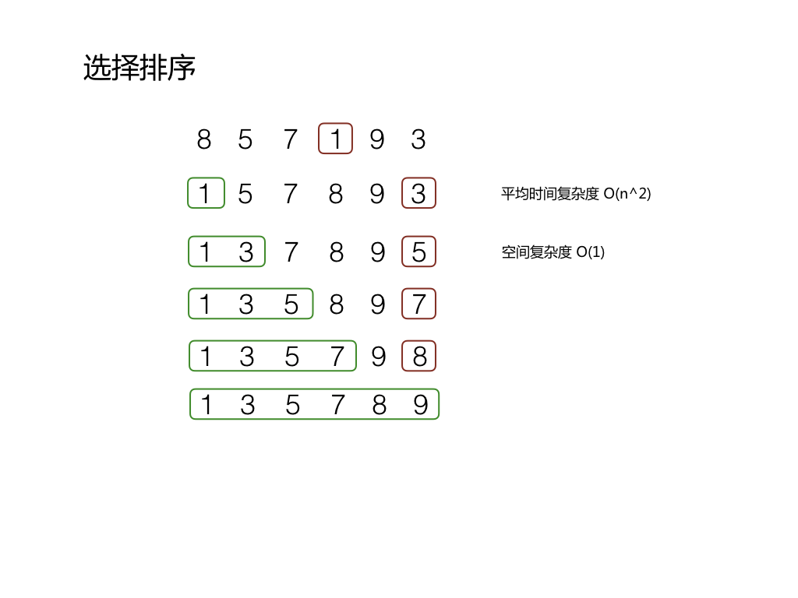

### 选择排序

首先在未排序序列中找到最小元素，存放到排序序列的起始位置，
然后，再从剩余未排序元素中继续寻找最小元素，然后放到已排序序列的末尾。
以此类推，直到所有元素均排序完毕。


#### 算法描述

算法如下:
1. 从第一个元素开始，选择最小的元素放到第一个位置
2. 选择下一个最小的元素放到已排序序列的末尾
3. 重复第二个步骤直至所有元素有序

无论初始序列怎么排列，选择排序都需要操作 n^2 级别
所以时间复杂度为 O(n^2), 空间复杂读为 O(1)

排序结果不稳定。

原地操作几乎是选择排序的唯一优点，当空间复杂度要求较高时，可以考虑选择排序；实际适用的场合很少。




#### 代码实现

```java

public static void sort(Integer a[]){
        int length = a.length;

        for(int i = 0; i < length; i++) {

            int smallestIndex = i;
            for(int j = i; j < length; j++) {

                if(a[smallestIndex] > a[j]) {
                    smallestIndex = j;
                }
            }
            int temp = a[smallestIndex];
            a[smallestIndex] = a[i];
            a[i] = temp;
        }
    }

```
