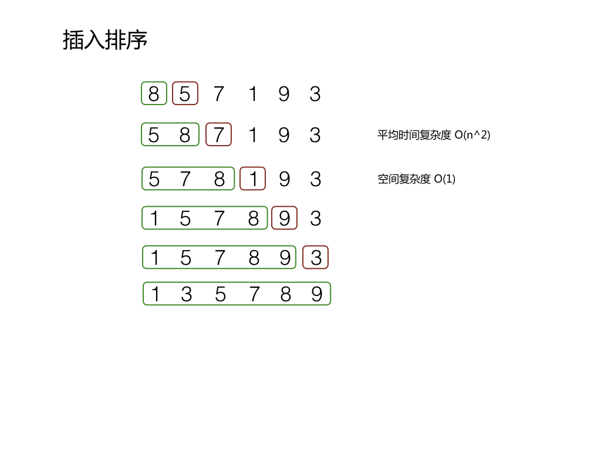

### 插入排序

插入排序是通过构建有序序列，对于没有排序的数据，在已排序的序列中从后向前扫描，找到相应的位置插入。
插入排序采用的是 in-place 排序(即只需要 O(1) 的额外空间的排序)


#### 算法描述

算法如下：

1. 从第一个元素开始，这个元素可以被确定为已排序
2. 取下一个元素，在已排序的序列中从后向前比较
3. 如果该元素小于已排序的一个元素，则这两个元素互换位置
4. 重复步骤3，直到找到小于或者等于该元素的已排序元素，将该元素插入到这个元素后面
5. 重复上面的2-4步骤

最好的情况下，序列就是按照升序的方式来排列的，就不需要移动元素了，所以需要操作 n-1 次，
最坏的情况是降序排列的，则每个元素都需要移动，所以需要操作 (n-1) * (n/2) 次。

所以插入排序的时间复杂度为 O(n^2),空间复杂度为 O(1)。

插入排序不适合用于数据量很大的一个排序，在数据量小的时候非常适用。




#### 代码实现

```java
public static void sort(Integer a[]) {
        int length = a.length;
        
        for(int i = 0; i < length -1; i++) {
            for(int j = i+1; j > 0; j--) {
                if(a[j] >= a[j-1])
                    break;
                int temp = a[i];
                a[i] = a[j];
                a[j] = temp;
            }

        }
    }

```
